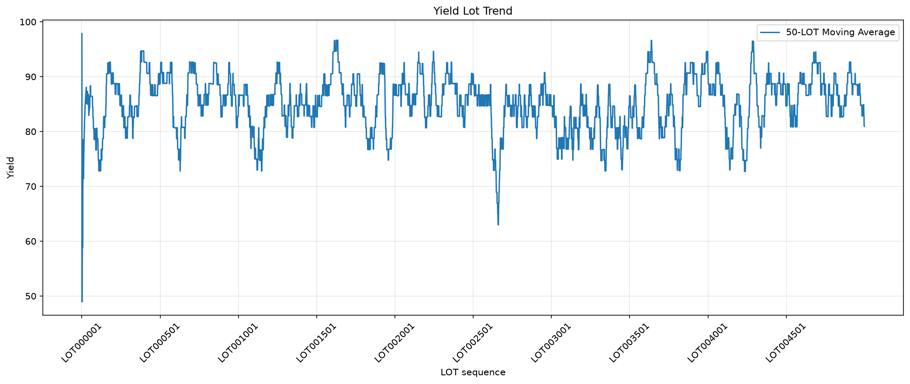
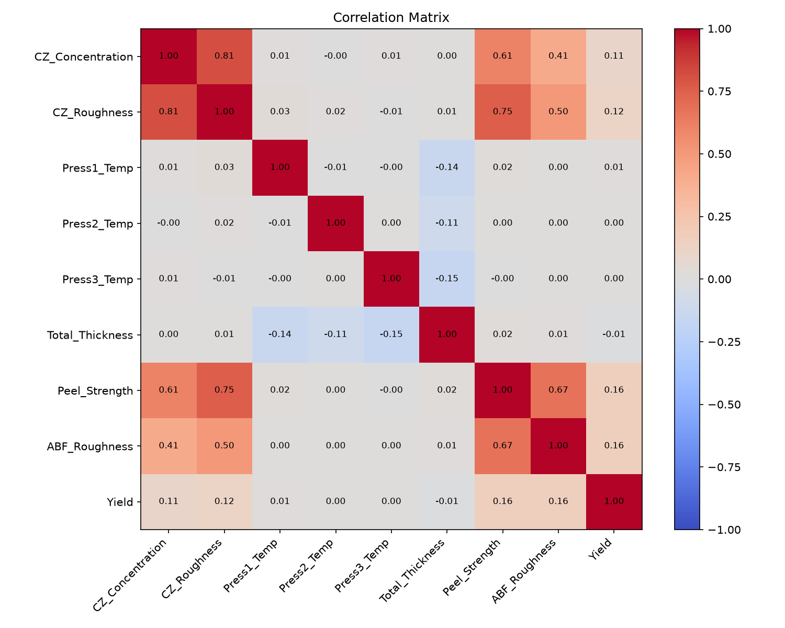
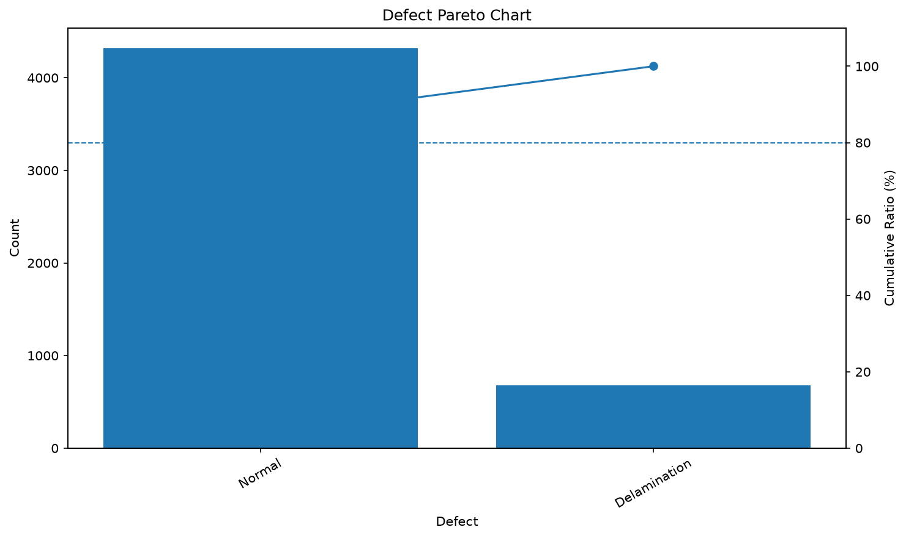
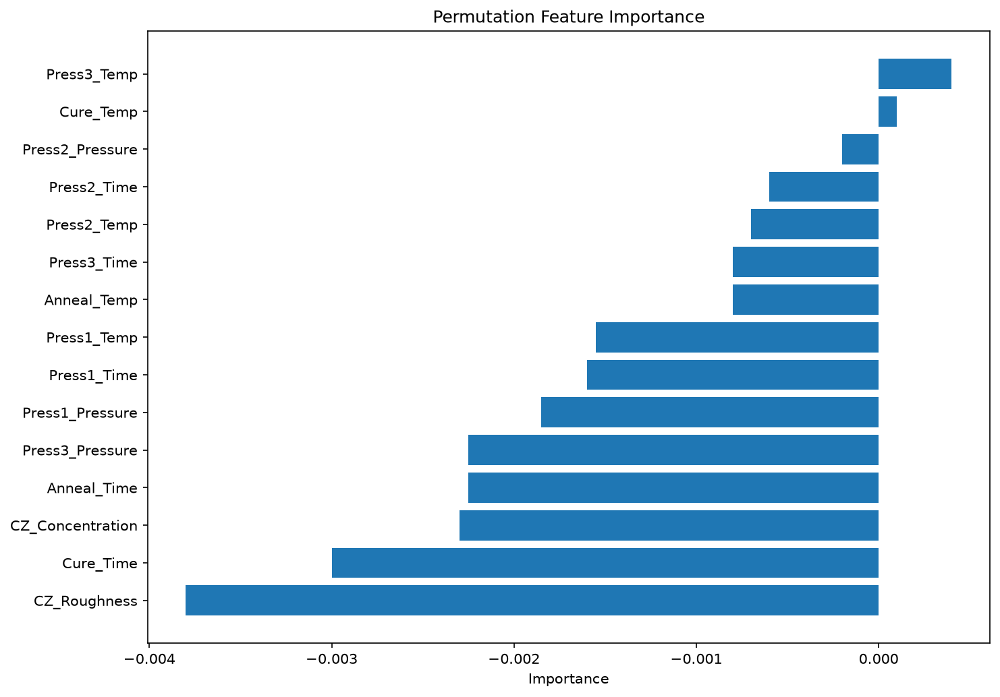
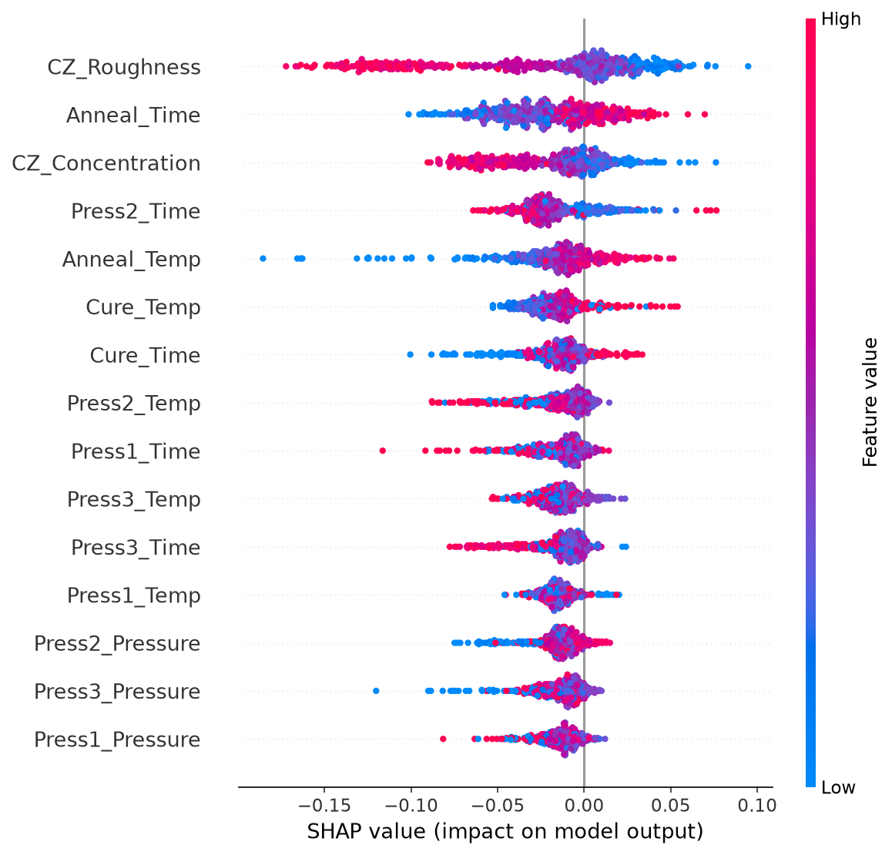
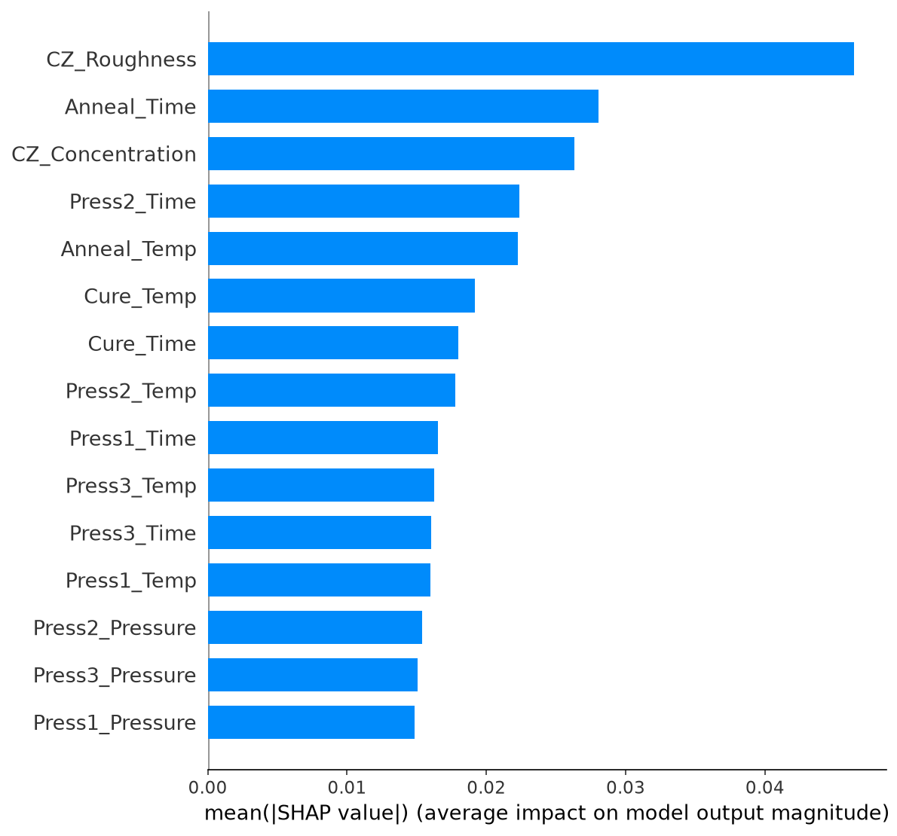

# Real Manufacturing AI

제조·공정 경험을 기반으로 가상의 공정 데이터를 생성하고,  
통계 분석·시각화·불량 예측·원인 해석·자동 보고서를 수행하는 제조 데이터 분석 프로젝트입니다.

> Synthetic Process Data → SPC → Defect Analysis → Machine Learning → Explainable AI → Dashboard

---

## 1. Project Overview

이 프로젝트의 목적은 단순한 머신러닝 모델 생성이 아니라 다음 과정을 하나의 시스템으로 구현하는 것입니다.

- 제조 공정 데이터 생성
- 공정 안정성 및 추세 분석
- 관리 범위 이탈 LOT 탐지
- 불량 유형 및 영향 인자 분석
- 머신러닝 기반 불량 예측
- SHAP 기반 예측 원인 해석
- Streamlit 기반 대시보드
- CSV 일괄 예측 및 PDF 보고서 생성

현재 데이터는 실제 회사 데이터를 사용하지 않고, 제조 공정의 경험적 관계를 반영해 생성한 가상 데이터입니다.

---

## 2. Main Features

| 기능 | 내용 |
|---|---|
| Process Data Generator | 공정 기준과 인과관계를 반영한 5,000개 LOT 생성 |
| Data Validation | 결측치, 중복 LOT, 필수 컬럼 및 데이터 구조 검사 |
| Trend Analysis | LOT 순서별 이동평균 기반 품질 Trend 분석 |
| SPC Analysis | 평균, 관리선, Spec, 이상점 및 Cpk 분석 |
| Correlation Analysis | 공정 인자와 품질 결과 간 상관관계 분석 |
| Defect Analysis | 불량 Pareto 및 불량별 인자 비교 |
| Outlier Detection | 관리범위 이탈 인자와 이상 LOT 자동 추출 |
| Defect Prediction | Random Forest 기반 불량 분류 |
| Explainable AI | Permutation Importance 및 SHAP 분석 |
| Dashboard | 필터, 단일 예측, CSV 일괄 예측 및 다운로드 |
| PDF Report | 주요 분석 결과 자동 보고서 생성 |

---

## 3. Analysis Pipeline

```text
Process Specification
        ↓
Synthetic Data Generation
        ↓
Data Validation
        ↓
Trend / SPC / Correlation
        ↓
Defect & Outlier Analysis
        ↓
Random Forest Training
        ↓
Feature Importance / SHAP
        ↓
Single & Batch Prediction
        ↓
Streamlit Dashboard
        ↓
PDF Report
```

---

## 4. Dataset

### Process Inputs

- CZ_Concentration
- Press1_Temp / Time / Pressure
- Press2_Temp / Time / Pressure
- Press3_Temp / Time / Pressure
- Cure_Temp / Time
- Anneal_Temp / Time

### Quality Outputs

- CZ_Roughness
- Total_Thickness
- Peel_Strength
- ABF_Roughness
- Delam_Panel_Count
- Defect
- Yield

### Defect Classes

- Normal
- Delamination

향후 아래 불량 유형으로 확장할 예정입니다.

- ABF Delamination
- ABF Pore
- Pattern Delamination

---

## 5. Process Simulation Logic

가상 데이터는 각 컬럼을 독립적으로 무작위 생성하지 않습니다.

공정 경험을 기반으로 다음과 같은 관계를 반영했습니다.

```text
CZ Concentration
        ↓
CZ Roughness
        ↓
Peel Strength
        ↓
ABF Roughness
        ↓
Delamination Probability
        ↓
Yield
```

추가 반영 관계:

- Press 온도와 시간이 증가하면 Total Thickness가 감소
- Cure 및 Anneal 조건이 Peel Strength에 영향
- Peel Strength와 ABF Roughness가 낮아질수록 Delamination 위험 증가
- Panel 불량 발생 여부에 따라 LOT 불량과 Yield 결정

현재 계수는 실제 공정값이 아닌 시뮬레이션용 가정값입니다.

---

## 6. Analysis Results

### LOT Yield Trend



### Correlation Matrix



### Defect Pareto



### Permutation Feature Importance



### SHAP Summary



### SHAP Feature Importance



> 이미지가 표시되지 않으면 `images` 폴더의 실제 파일명과 README의 경로를 확인하세요.

---

## 7. Machine Learning

### Model

```text
RandomForestClassifier
```

### Target

```text
Defect
```

### Main Evaluation Outputs

- Accuracy
- Precision
- Recall
- F1-score
- Confusion Matrix
- Random Forest Feature Importance
- Permutation Importance
- SHAP Importance

모델 파일은 다음 경로에 저장됩니다.

```text
models/random_forest_defect_model.joblib
```

---

## 8. Dashboard

Streamlit 대시보드에서는 다음 기능을 제공합니다.

### Process Dashboard

- Model 및 Machine 필터
- Yield 범위 필터
- LOT 검색
- 총 LOT 수
- 불량 LOT 수 및 불량률
- 평균 Yield
- Yield 이동평균 Trend
- 설비별 품질 비교
- Correlation Matrix
- 원본 데이터 조회

### Single Prediction

- 공정 조건 수동 입력
- 예상 불량 유형 출력
- 클래스별 예측 확률 출력

### Batch CSV Prediction

- CSV 업로드
- 필수 컬럼 자동 검증
- 전체 LOT 일괄 예측
- 불량 위험 LOT 집계
- 예측 결과 CSV 다운로드

### PDF Report

- 공정 요약
- Yield Trend
- Defect Pareto
- 설비별 불량률
- 품질 인자 통계
- PDF 다운로드

---

## 9. Project Structure

```text
Real_Manufacturing_AI/
│
├── Data/
│   └── process_monitoring_data.csv
│
├── images/
├── models/
├── report/
│
├── src/
│   ├── analysis/
│   │   ├── correlation.py
│   │   ├── defect_analysis.py
│   │   ├── outlier.py
│   │   ├── spc.py
│   │   └── trend.py
│   │
│   ├── dashboard/
│   │   ├── app.py
│   │   └── pages/
│   │       └── 4_PDF_Report.py
│   │
│   ├── data/
│   │   ├── generate_process_data.py
│   │   └── loader.py
│   │
│   ├── ml/
│   │   ├── batch_predict.py
│   │   ├── random_forest.py
│   │   ├── shap_analysis.py
│   │   └── train_model.py
│   │
│   ├── report/
│   │   └── pdf_report.py
│   │
│   └── process_spec.py
│
├── .gitignore
├── README.md
└── requirements.txt
```

실제 폴더 및 파일 이름과 다르면 현재 프로젝트 구조에 맞게 수정하세요.

---

## 10. Installation

저장소를 내려받은 뒤 프로젝트 최상위 폴더에서 실행합니다.

```bash
python -m pip install -r requirements.txt
```

---

## 11. How to Run

### 데이터 생성

```bash
python -m src.data.generate_process_data
```

### 데이터 검증

```bash
python -m src.data.loader
```

### Trend 분석

```bash
python -m src.analysis.trend
```

### SPC 분석

```bash
python -m src.analysis.spc
```

### Correlation 분석

```bash
python -m src.analysis.correlation
```

### Defect 분석

```bash
python -m src.analysis.defect_analysis
```

### 이상 LOT 추출

```bash
python -m src.analysis.outlier
```

### Random Forest 분석

```bash
python -m src.ml.random_forest
```

### 모델 학습 및 저장

```bash
python -m src.ml.train_model
```

### SHAP 분석

```bash
python -m src.ml.shap_analysis
```

### CSV 일괄 예측

```bash
python -m src.ml.batch_predict
```

### PDF 보고서 생성

```bash
python -m src.report.pdf_report
```

### Streamlit Dashboard

```bash
python -m streamlit run src/dashboard/app.py
```

대시보드 주소:

```text
http://localhost:8501
```

---

## 12. Generated Outputs

```text
images/
├── correlation_matrix.png
├── defect_pareto.png
├── permutation_feature_importance.png
├── shap_bar.png
├── shap_summary.png
└── yield_lot_trend.png
```

```text
report/
├── batch_prediction_result.csv
├── confusion_matrix.csv
├── feature_importance.csv
├── lot_abnormal_summary.csv
├── manufacturing_process_analysis_report.pdf
├── model_test_predictions.csv
├── parameter_outliers.csv
└── shap_importance.csv
```

---

## 13. Limitations

- 현재 데이터는 실제 생산 데이터가 아닌 합성 데이터입니다.
- 공정 인과관계와 계수는 경험적 가정을 기반으로 설정했습니다. (사실이 아닌 부분도 있습니다.)
- 모델 성능은 데이터 생성식의 영향을 크게 받습니다.
- 높은 Accuracy가 실제 현장 성능을 의미하지는 않습니다. (실제 현장은 더 많은 데이터와 변수가 있습니다. ex : 작업자, 작업시간, 자재 해동시간, 치공구 등)
- 실제 데이터 적용 시 시간 순서, 공정 이력, 설비 편차 및 데이터 누락을 추가로   고려해야 합니다.

---

## 14. Future Work

- 다중 불량 유형 예측
- XGBoost 및 LightGBM 모델 비교
- 이상 탐지 모델 적용
- Model 및 Machine별 편차 반영
- 시간 순서 기반 Train/Test 분리
- 공정별 Feature Engineering
- DOE 및 ANOVA 분석
- 공정 조건 최적화
- 모델 재학습 기능
- 실시간 데이터 입력 시뮬레이션
- 데이터베이스 연동
- Streamlit Cloud 배포
- 자동 테스트 및 CI 파이프라인 구축

---

## 15. Tech Stack

- Python
- Pandas
- NumPy
- Matplotlib
- Scikit-learn
- SHAP
- Streamlit
- Joblib
- OpenPyXL
- Git
- GitHub
- Visual Studio Code

---

## 16. Author

Manufacturing process engineer developing capabilities in:

- Manufacturing Data Analysis
- Statistical Process Control
- Defect Analysis
- Process Automation
- Machine Learning
- Explainable AI