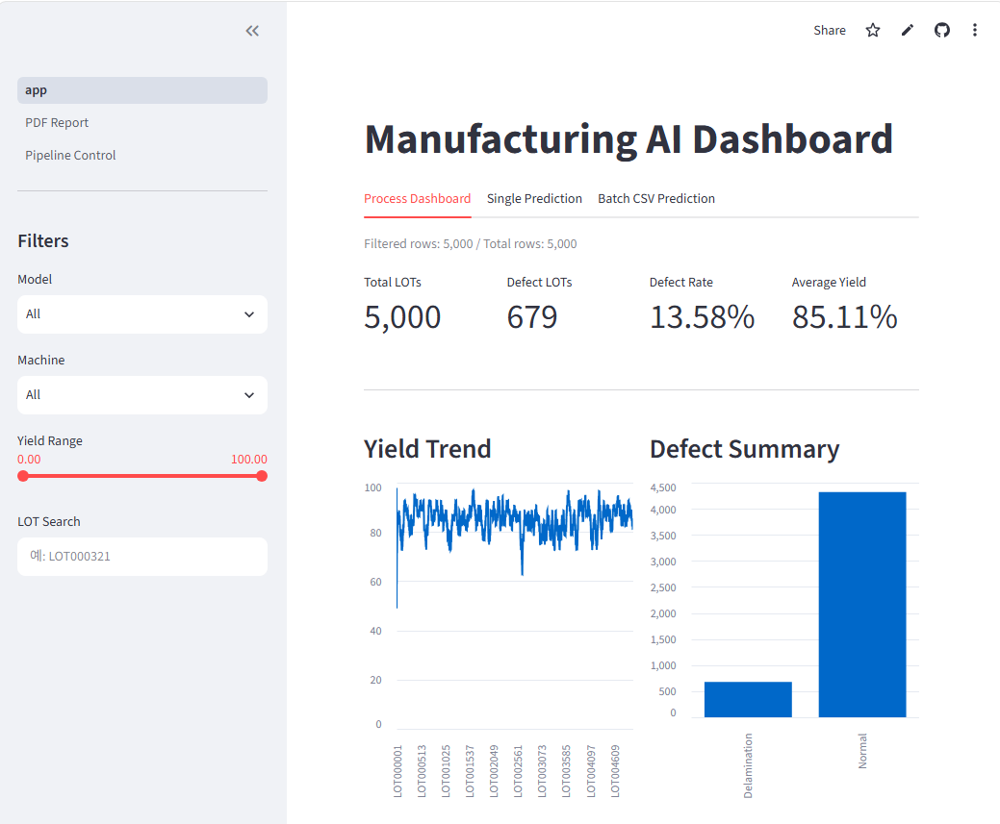
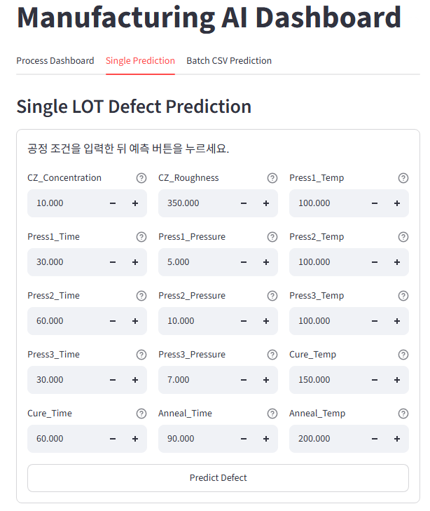
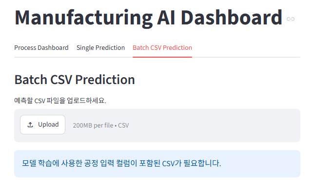
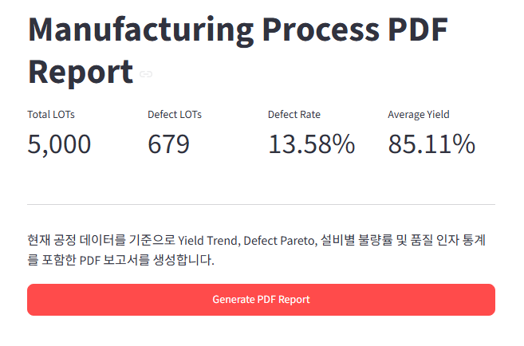

# 🚀 Manufacturing AI Dashboard

[](https://github.com/Thisissun93/Real_Manufacturing_AI/actions/workflows/manufacturing_ai.yml)

A Manufacturing AI Platform for Semiconductor Process Monitoring, SPC Analysis, Machine Learning, Defect Prediction, and Interactive Dashboard.

---

# 📌 Project Overview

This project simulates a semiconductor manufacturing process and provides an end-to-end AI analytics platform.

The platform automatically generates manufacturing data, validates process quality, performs statistical analysis, trains machine learning models, predicts defects, generates reports, and visualizes everything through a Streamlit dashboard.

The entire workflow can be executed using a single automated pipeline.

---

# 🎯 Project Goals

- Generate realistic semiconductor process data
- Perform SPC & process monitoring
- Analyze process correlations
- Detect abnormal LOTs
- Predict process defects using Machine Learning
- Explain AI predictions using SHAP
- Visualize results with Streamlit
- Generate PDF reports
- Execute the complete workflow automatically

---

# 🏗 System Architecture

```text
Process Data Generator
        │
        ▼
SQLite Database
        │
        ▼
Data Validation
        │
        ▼
Analysis
 ├── Trend
 ├── SPC
 ├── Correlation
 ├── Defect Analysis
 └── Outlier Detection
        │
        ▼
Machine Learning
 ├── Random Forest
 ├── SHAP Explainability
 └── Batch Prediction
        │
        ▼
PDF Report
        │
        ▼
Streamlit Dashboard
```

---

# 📷 Dashboard Preview

## Main Dashboard



---

## Single LOT Prediction



---

## Batch Prediction



---

## PDF Report



---

# 📈 Analysis Features

## Process Trend

- LOT Trend
- Yield Trend
- Peel Strength Trend
- Thickness Trend

---

## Statistical Process Control (SPC)

- X-Bar Chart
- R Chart
- Process Capability
- Cp
- Cpk

---

## Correlation Analysis

- Correlation Matrix
- Heatmap

---

## Defect Analysis

- Pareto Chart
- Box Plot
- Yield Comparison
- Defect Distribution

---

## Outlier Detection

- SPC Rule Based Detection
- LOT Summary
- Outlier Export

---

# 🤖 Machine Learning

Model

- Random Forest Classifier

Prediction Target

- Delamination

Input Features

- CZ Concentration
- CZ Roughness
- Press Conditions
- Cure Conditions
- Anneal Conditions

Outputs

- Defect Prediction
- Prediction Probability
- Feature Importance
- SHAP Values

---

# 🧠 Explainable AI

This project includes SHAP analysis for model explainability.

Generated outputs

- SHAP Summary Plot
- Feature Importance
- Feature Ranking

---

# 📂 Project Structure

```text
Real_Manufacturing_AI
│
├── Data
├── database
├── images
├── logs
├── models
├── notebook
├── report
│
├── src
│   ├── analysis
│   ├── dashboard
│   ├── data
│   ├── database
│   ├── ml
│   ├── pipeline
│   ├── report
│   ├── utils
│   └── visualization
│
├── tests
│
├── config.yaml
├── requirements.txt
└── README.md
```

---

# ⚙ Technologies

Programming

- Python

Data

- Pandas
- NumPy

Visualization

- Matplotlib
- Streamlit

Machine Learning

- Scikit-Learn
- SHAP

Database

- SQLite

Automation

- GitHub Actions

Testing

- Pytest

---

# 🔄 Pipeline

Run the complete workflow

```bash
python -m src.pipeline.run_pipeline
```

Pipeline automatically performs

- Process Data Generation
- SQLite Update
- Data Validation
- Trend Analysis
- SPC Analysis
- Correlation Analysis
- Defect Analysis
- Outlier Detection
- Model Training
- Random Forest Analysis
- SHAP Analysis
- Batch Prediction
- PDF Report Generation

---

# 💻 Run Dashboard

```bash
streamlit run src/dashboard/app.py
```

---

# ☁ Online Demo

Streamlit Cloud

https://realmanufacturingai-gqmhke2ybcjhdrsndjsh2e.streamlit.app/
---

# ✅ Continuous Integration

GitHub Actions automatically executes

- Dependency Installation
- Unit Test
- Manufacturing AI Pipeline

Every push to **main** triggers automatic validation.

---

# 📊 Current Features

- Synthetic Manufacturing Data Generator

- SQLite Database

- SPC Analysis

- Trend Analysis

- Correlation Analysis

- Defect Analysis

- Outlier Detection

- Random Forest

- SHAP Explainability

- Batch Prediction

- PDF Report

- Streamlit Dashboard

- Pipeline Automation

- GitHub Actions

- Pytest

---

# 🚀 Future Work

- XGBoost Model

- LightGBM

- DOE Optimization

- Bayesian Optimization

- Vision Inspection AI

- Predictive Maintenance

- Docker Deployment

- Cloud Database

---

# 👨‍💻 Author

TaeYang Kim

Manufacturing AI Engineer

GitHub

https://github.com/Thisissun93